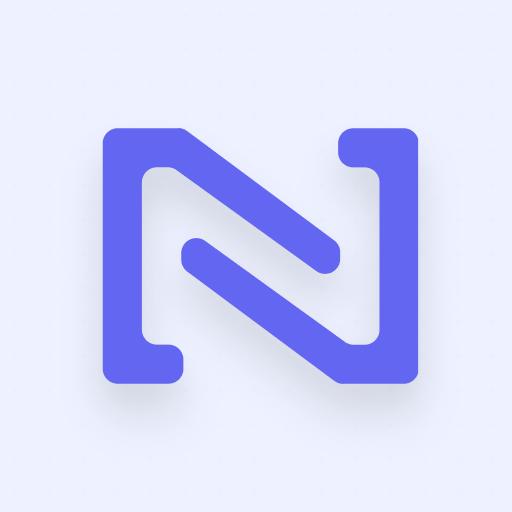

# NervesHub Mobile

A React Native mobile client for [NervesHub](https://www.nerves-hub.org/).

Manage your NervesHub devices, deployments, and firmware from your phone.

## Features

- Login to your NervesHub instance
- View and select Organizations & Products
- Browse and manage devices, deployment groups, and firmware
- Live device console via the NervesHub API socket
- Pin frequently accessed devices (Coming soon)
- Create, edit, delete, and run support scripts on connected devices
- Pin devices for quick access
- Download firmware and generate CA verification tokens
- Dark mode support

## Prerequisites

- Node.js
- [Expo CLI](https://docs.expo.dev/get-started/installation/)
- iOS: Xcode and CocoaPods
- Android: Android Studio

## Getting Started

```bash
npm install
```

### iOS

```bash
npx expo run:ios
```

### Android

```bash
npx expo run:android
```

## API Client Generation

The API client is generated from the live NervesHub OpenAPI spec using [Orval](https://orval.dev/). The sync step normalizes known upstream contract issues and keeps generated paths relative to the app's `/api` base URL:

```bash
yarn api:update
```

Use `yarn api:generate` when `openapi/nerveshub.json` is already current, or `yarn api:sync` to refresh the normalized spec without regenerating.

## Project Structure

```
src/
  api/          # Generated API client and custom Axios instance
  components/   # Reusable UI components
  context/      # Auth and org/product context providers
  hooks/        # Custom hooks (API, channels, orgs)
  navigation/   # React Navigation stack and tab definitions
  screens/      # App screens (devices, deployments, firmware, etc.)
  theme/        # Colors, spacing, and theming utilities
  utils/        # Secure storage and persistence helpers
```
